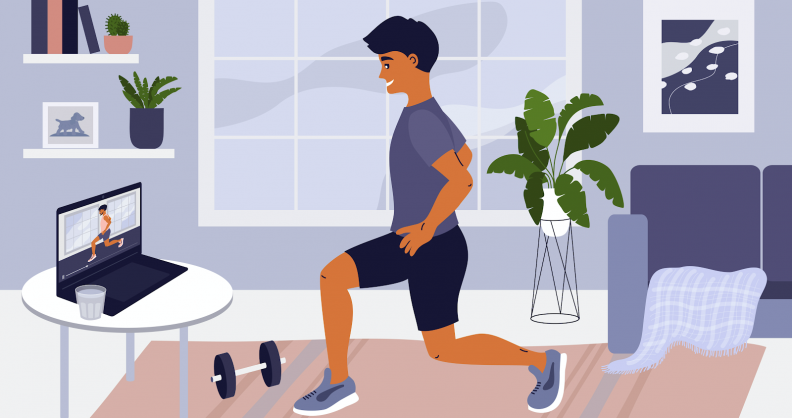
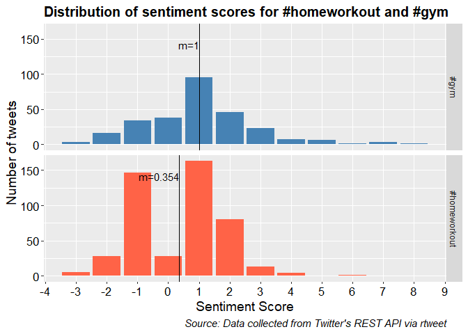

MATH513 Big Data and Social Network Visualization Practical
\#Homeworkout vs \#Gym
================
“10576468, 10546918, 10700016”
2020-12-10

## Comparison of Gyms and Home Workouts

 
*Image (left): Cartoon doing barbells in gym, by Strelnikova, from:
freepik.com*  
*Image (right): Cartoon doing lunges in home, by Macrovector, from:
dreamstime.com*

## Type Of Tweets

<!-- -->

## Tweet Frequency

<!-- -->

## Tweet Frequency

<!-- -->

## Top Locations

<!-- -->

## World Base Map

<!-- -->

## Sentiment Analysis

<!-- -->

## Sentiment Analysis

<!-- -->

## Sentiment Analysis

<!-- -->

## Summary Statistics

|     Tweet     | Mean | Median | Variance |  Sd  | IQR | Min | Max |
| :-----------: | :--: | :----: | :------: | :--: | :-: | :-: | :-: |
|     \#gym     | 1.00 |   1    |   3.11   | 1.76 |  2  | \-3 |  8  |
| \#homeworkout | 0.35 |   1    |   2.02   | 1.42 |  2  | \-3 |  6  |

## Statistical Testing

**T-test assumptions:**

1.  Scale of measurement
2.  Simple random sampling
      - *not everyone uses social media the same way*
      - *language restriction*
3.  Adequacy of sample.
4.  Equality of variance in standard deviation.
      - *one point difference in variance*
5.  Normality of data distribution

## Statistical Testing

<!-- -->

## Statistical Testing

### Shapiro–Wilk test

  - \(H_0:\) *The distribution of our data sample is not significant
    different, from a normal distribution*

  - \(H_1:\) *The distribution of our data sample is significant
    different, from a normal distribution*

**\#homeworkout** : \(P-value= 2.8 \times 10^{-16} < 0.05\)  
**\#gym** : \(P-value= 1 \times 10^{-9} < 0.05\)  
At the 5% significance level, we reject the null hypothesis \(H_0\). 

**There is a significance difference between the distributions of the
samples and the normal distribution**

## Statistical Testing

### Mann-Whitney U test

  - \(H_0:\) *The The mean ranks of the two groups are equal*

  - \(H_1:\) *The mean ranks of the two groups are not equal*

\(P-value= 3.6 \times 10^{-16} < 0.05\)  
At the 5% significance level, we reject the null hypothesis \(H_0\).  

**The sentiment mean rank scores between tweets with \#gym and
\#homeworkout are significant different**

## Conclusions

  - Observe a new trend in fitness industry where people prefer home
    workouts.

  - Businesses can use this information to produce new products and
    services therefore increase their profits in a competitive industry.

## References

  - Faraway, J.J, (2004). *Linear Models with R*, Chapman and Hall/CRC
  - Witte, R.S. and Witte J.S, (2016). *Statistics*, 11th ed. Willey
  - Kales, S., (2019). The rise of digital fitness: can the new wave of
    high-intensity home workouts replace the gym?. *The Guardian*
    \[online\]. 19 August. Updated 19 August 2019, 10:00. \[Viewed 08
    December 2020\]. Available from:
    <https://www.theguardian.com/lifeandstyle/2019/aug/19/the-rise-of-digital-fitness-can-the-new-wave-of-high-intensity-home-workouts-replace-the-gym>

## References

  - Strelnikova, O., *Cartoon doing lunges in home* \[Online\]. \[Viewed
    09 December 2020\]. Available from:
    <https://www.dreamstime.com/stay-home-doing-exercise-online-keep-fit-positive-man-laptop-training-gym-sport-internet-fitness-workout-healthy-image178965240?hcb=1>
  - Macrovector. *Cartoon doing barbells in gym* \[Online\]. \[Viewed 09
    December 2020\]. Available at:
    <https://www.freepik.com/free-vector/man-training-arm-muscles-with-dumbbells-gym-cartoon_3795972.htm>
